<!-- generated-by: gsd-doc-writer -->
# Architecture Overview

Mythika: Echoes of the Divine is a mobile-first idle/cultivation RPG with turn-based combat, built entirely in vanilla JavaScript (ES6+) targeting HTML5 Canvas 2D. The game runs offline as a PWA with no build step, loading 72 scripts directly from `index.html`.

## System Overview

The game follows a layered architecture with a core engine kernel supporting game logic systems and scene-based UI. The entire application state lives in a single global object (`G.state`), and rendering uses an immediate-mode Canvas 2D approach where every frame is rebuilt from scratch.

**Primary inputs**: Touch/mouse/keyboard interactions via unified input pipeline  
**Primary outputs**: 60fps Canvas 2D rendering with procedural audio synthesis  
**Architectural style**: Layered with global state singleton, immediate-mode rendering, scene state machine

## Component Diagram

```mermaid
graph TD
    subgraph Engine["Engine Layer (src/engine/)"]
        Game["game.js<br/>Global state G<br/>Game loop"]
        Renderer["renderer.js<br/>Drawing primitives<br/>Effects/Projectiles"]
        Scene["scene.js<br/>Scene factory<br/>Transitions"]
        Input["input.js<br/>Touch/Mouse<br/>Swipe detection"]
        Audio["audio.js<br/>Procedural synthesis<br/>Music tracks"]
    end

    subgraph Systems["Game Systems (src/systems/)"]
        Combat["combat.js<br/>Turn-based battles"]
        Progression["progression.js<br/>XP/Levels/Scaling"]
        Cultivation["cultivation_sys.js<br/>Realms/Breakthrough"]
        Save["save.js<br/>localStorage/Migration"]
        Farm["farm_sys.js<br/>Idle herb farming"]
        Journey["journey.js<br/>Narrative choices"]
        Alchemy["alchemy.js<br/>Potion crafting"]
        Economy["economy.js<br/>Gold/Gems"]
        Quests["quests.js<br/>Quest tracking"]
        Duel["duel.js<br/>Tournament mode"]
        Achievements["achievements.js<br/>Achievement checks"]
    end

    subgraph Data["Static Data (src/data/)"]
        Heroes["heroes.js"]
        Enemies["enemies.js"]
        Zones["zones.js"]
        Realms["cultivation.js"]
        Items["items.js"]
        Perks["perks.js"]
        Auras["auras.js"]
        Classes["classes.js"]
        QuestsData["quests.js"]
        Journeys["journeys.js"]
        AchievementsData["achievements.js"]
        AlchemyRecipes["alchemy_recipes.js"]
        SpiritBeasts["spirit_beasts.js"]
        Encounters["encounters.js"]
    end

    subgraph Scenes["Scene Layer (src/scenes/)"]
        TitleScene["title.js"]
        AshramScene["ashram.js"]
        CombatScene["combatScene.js"]
        TravelMap["travelMap.js"]
        ZoneExploration["zoneExploration.js"]
        PartyScene["party.js"]
        CultivationScene["cultivationScene.js"]
        AlchemyScene["alchemyScene.js"]
        SpiritBeastScene["spiritBeast.js"]
        QuestLog["questLog.js"]
        OtherScenes["25+ other scenes"]
    end

    subgraph UI["UI Components (src/ui/)"]
        Buttons["button.js<br/>MagneticBtn, HUD"]
        Panels["panel.js"]
        Modals["modal.js"]
        Progress["progress.js"]
        Lists["list.js"]
        TabBar["tabbar.js"]
        Text["text.js"]
    end

    %% Engine connections
    Game --> Scene
    Game --> Renderer
    Game --> Input
    Game --> Audio
    Scene --> Renderer
    Input --> Scene

    %% Systems to Engine
    Combat --> Renderer
    Combat --> Audio
    Save --> Game
    Farm --> Game

    %% Systems to Systems
    Combat --> Progression
    Combat --> Achievements
    Progression --> Cultivation
    Journey --> Achievements
    Alchemy --> Economy
    Duel --> Combat

    %% Systems to Data
    Combat --> Enemies
    Combat --> Heroes
    Progression --> Heroes
    Progression --> Zones
    Cultivation --> Realms
    Journey --> Journeys
    Journey --> QuestsData
    Alchemy --> AlchemyRecipes
    Alchemy --> Items

    %% Scenes to Systems
    AshramScene --> Cultivation
    AshramScene --> Economy
    AshramScene --> Journey
    CombatScene --> Combat
    TravelMap --> Zones
    ZoneExploration --> Combat
    PartyScene --> Progression
    CultivationScene --> Cultivation
    AlchemyScene --> Alchemy
    SpiritBeastScene --> Farm

    %% Scenes to UI
    TitleScene --> Buttons
    AshramScene --> Buttons
    AshramScene --> TabBar
    CombatScene --> Progress
    CombatScene --> Modals
```



## Data Flow

A typical gameplay request flows through the system as follows:

1. **User Input**: Player taps/clicks in the Canvas → `Input` module queues tap event
2. **Input Processing**: Game loop iteration picks up queued tap → passes to active scene's `update(dt)`
3. **Scene Logic**: Scene checks button hitboxes via `UI.handleButtons()` → triggers action (e.g., "Travel to Zone")
4. **System Call**: Scene calls relevant system (e.g., `gScene('zoneExploration')` with zone data)
5. **State Mutation**: System reads/writes `G.state` (e.g., `G.state.currentZone = {id, enemies, progress}`)
6. **Scene Transition**: `Fade.toScene()` called → old scene's `leave()` → new scene's `enter()` with data
7. **Rendering**: Game loop calls current scene's `render(ctx)` → immediate-mode Canvas drawing
8. **Persistence**: `SaveSystem.autoSave()` periodically serializes `G.state` to localStorage

**Combat Flow Example**:
```
Player attack button → combatScene.update() 
  → Combat.performAttack(hero, enemy, skill)
  → calcDamage() → enemy.hp -= damage
  → Progression.addPartyXP()
  → AchievementSystem.check()
  → Audio.playSFX('hit')
  → Renderer.drawDamageNumber()
  → SaveSystem.autoSave()
```

**Idle Progression Flow**:
```
App backgrounded → FarmSystem.tick() continues
  → Calculate offline progress on next load
  → SaveSystem.load() → applies offlineTime multiplier
  → CultivationSystem.applyOfflineGains()
  → UI shows "You gained X cultivation while away"
```

## Key Abstractions

| Abstraction | Description | File |
|-------------|-------------|------|
| **Global State (`G`)** | Singleton containing `state`, `canvas`, `loop`, scene registry | `src/engine/game.js` |
| **Renderer (`R`)** | All drawing primitives, effects, color tokens, fonts | `src/engine/renderer.js` |
| **Scene Factory** | `Scene.create(def)` returns `{name, enter, leave, update, render, data}` | `src/engine/scene.js` |
| **System Pattern** | Namespace objects (`Combat`, `Progression`, etc.) that operate on `G.state` | `src/systems/*.js` |
| **UI Component** | Factory function returning `{render, update, onClick, contains}` | `src/ui/button.js` |
| **MagneticBtn** | Spring-physics button (stiffness=120, damping=22) with magnetic icon follow | `src/ui/button.js` |
| **Data Module** | Immutable lookup tables exported as global constants | `src/data/*.js` |
| **Scrollable Content** | Standard pattern: `scrollY`, `contentHeight`, `clampScroll()`, clip+translate | `src/engine/scene-helpers.js` |
| **Fade Transition** | Async 150ms fade-out → scene swap → 250ms fade-in | `src/engine/game.js` |
| **Watchdog Loop** | rAF wrapped in try/catch for crash recovery, adaptive reduce motion | `src/engine/game.js` |

## Directory Structure

```
Mythika/
├── index.html              # Entry point, 72 script tags in dependency order
├── manifest.json           # PWA manifest (name, icons, theme_color)
├── sw.js                   # Service worker (cache-first offline strategy)
├── styles/
│   └── game.css           # Container scaling, DPR handling
├── src/
│   ├── main.js            # Boot sequence, scene registration, service worker
│   ├── engine/            # Core engine kernel
│   │   ├── game.js        # Global state G, game loop, scene manager
│   │   ├── renderer.js    # All drawing primitives, effects, projectiles
│   │   ├── scene.js       # Scene factory, registry, transitions
│   │   ├── scene-helpers.js  # Scroll utilities, premium UI patterns
│   │   ├── input.js       # Touch/mouse/keyboard, tap queue, swipe
│   │   ├── audio.js       # Procedural synthesis, music tracks, SFX
│   │   ├── auth.js        # Firebase authentication integration
│   │   └── firebase-config.js  # Firebase project configuration
│   ├── data/              # Static game data (14 files)
│   │   ├── heroes.js      # 3 launch heroes + stat calculations
│   │   ├── enemies.js     # ~30 enemy definitions + abilities
│   │   ├── zones.js       # 15+ zone definitions with encounters
│   │   ├── cultivation.js # Realms, breakthrough thresholds
│   │   ├── items.js       # Equipment, consumables, materials
│   │   ├── perks.js       # Passive upgrades
│   │   ├── auras.js       # Equippable aura effects
│   │   ├── classes.js     # Character classes (Warrior, Sage, Ascetic)
│   │   ├── spirit_beasts.js  # Spirit beast progression
│   │   ├── quests.js      # Quest definitions
│   │   ├── journeys.js    # Narrative choice trees
│   │   ├── achievements.js # Achievement criteria
│   │   ├── alchemy_recipes.js  # Potion recipes
│   │   └── encounters.js  # Zone encounter tables
│   ├── systems/           # Game logic systems (12 files)
│   │   ├── combat.js      # Turn-based combat engine
│   │   ├── progression.js # XP, levels, difficulty scaling
│   │   ├── cultivation_sys.js  # Realm progression, idle tick
│   │   ├── save.js        # localStorage, migration, offline progress
│   │   ├── farm_sys.js    # Herb farming, passive income
│   │   ├── journey.js     # Narrative choices, aura unlocks
│   │   ├── alchemy.js     # Potion crafting
│   │   ├── economy.js     # Gold, gems, transactions
│   │   ├── achievements.js # Achievement tracking/checking
│   │   ├── quests.js      # Quest state management
│   │   ├── duel.js        # Tournament mode
│   │   └── zone_rewards.js  # Zone completion rewards
│   ├── scenes/            # Scene implementations (30 files)
│   │   ├── title.js       # Entry screen, continue/new/settings
│   │   ├── welcome.js     # First-run onboarding
│   │   ├── characterCreate.js  # Name + stat allocation
│   │   ├── ashram.js      # Home hub, navigation, upgrades
│   │   ├── travelMap.js   # Zone selection
│   │   ├── zoneExploration.js  # Zone gameplay
│   │   ├── combatScene.js # Battle screen
│   │   ├── party.js       # Party management
│   │   ├── cultivationScene.js  # Cultivation interface
│   │   ├── alchemyScene.js  # Crafting interface
│   │   ├── spiritBeast.js # Spirit beast management
│   │   ├── questLog.js    # Quest tracking
│   │   └── ... (17 more scenes)
│   └── ui/                # Reusable UI components (7 files)
│       ├── button.js      # Button, MagneticBtn, HUD, PremiumShell
│       ├── panel.js       # Container panels
│       ├── modal.js       # Modal dialogs
│       ├── progress.js    # Progress bars
│       ├── list.js        # Scrollable lists
│       ├── tabbar.js      # Tab navigation
│       └── text.js        # Text rendering utilities
└── .slim/                 # Architecture audit & planning
    ├── codemap.json       # File hashes for change detection
    └── deepwork/          # Implementation plans
```

**Rationale**: The project follows a strict layered architecture where:
- **Engine** provides low-level primitives (rendering, input, audio) without game logic
- **Systems** encapsulate game domains (combat, progression) as stateless operators on `G.state`
- **Scenes** are self-contained screens with standard lifecycle (`enter`, `update`, `render`, `leave`)
- **Data** is purely declarative configuration with no runtime logic
- **UI** components are reusable across scenes with consistent visual language

The immediate-mode rendering approach (no retained scene graph) simplifies state management at the cost of per-frame rebuild. The global state singleton (`G.state`) avoids Redux-style complexity for a single-player offline game.
